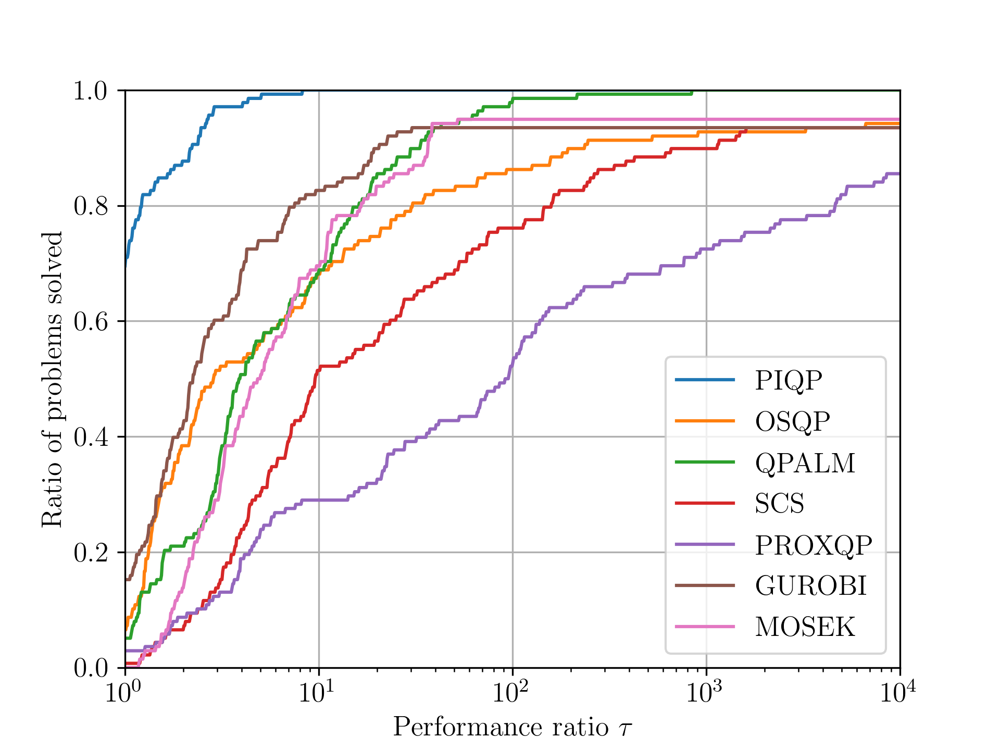
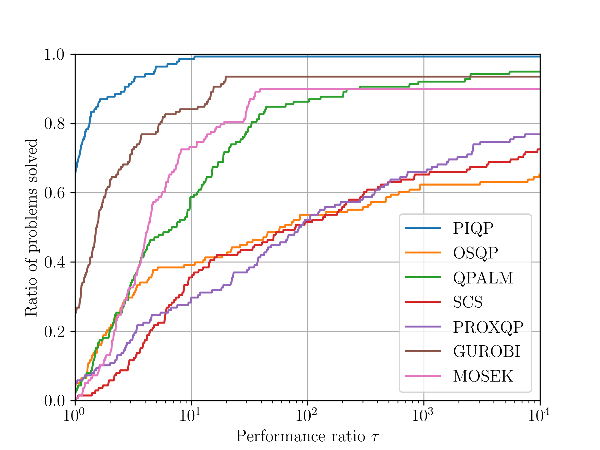

# Benchmark examples for the PIQP solver

**This repo is based on a striped down version of [osqp_benchmarks](https://github.com/osqp/osqp_benchmarks), i.e., it only contains the Maros Meszaros problems.**

These are the scripts to compare the following Quadratic Program (QP) solvers

-   PIQP
-   OSQP
-   SCS
-   PROXQP
-   GUROBI
-   MOSEK

To run these scripts you need `pandas` and `cvxpy` installed.

All the scripts come with options (default to `False`)

- `--parallel` for parallel execution across instances
- `--verbose` for verbose solvers output (they  can be slower than necessary while printing)
- `--high_accuracy` for high accuracy (`eps_abs=1e-08`, `eps_rel=1e-09`) solver settings + optimality checks (default is `eps_abs=1e-03`, `eps_rel=1e-04`)

## Maros Meszaros problems
These are the hard problems from the [Maros Meszaros testset](http://www.cuter.rl.ac.uk/Problems/marmes.shtml) converted using [CUTEst](https://ccpforge.cse.rl.ac.uk/gf/project/cutest/wiki) and the scripts in the [maros_meszaros_data/](./problem_classes/maros_meszaros_data) folder.
In these benchmarks we compare PIQP with OSQP, SCS, PROXQP, GUROBI and MOSEK.

To execute these tests run
```python
python run_maros_meszaros_problems.py
```

### Results
The resulting [shifted geometric means](http://plato.asu.edu/ftp/shgeom.html) for low accuracy (`eps_abs=1e-03`, `eps_rel=1e-04`) are

| PIQP | OSQP | SCS   | PROXQP | GUROBI | MOSEK |
| ---- | ---- | ----- | ------ | ------ | ----- |
| 1.0  | 7.18 | 15.55 | 27.23  | 6.59   | 18.66 |

<p align="center">
  
</p>

and for high accuracy (`eps_abs=1e-08`, `eps_rel=1e-09`) are

| PIQP | OSQP  | SCS   | PROXQP | GUROBI | MOSEK  |
| ---- | ----- | ----- | ------ | ------ | ------ |
| 1.0  | 42.01 | 32.92 | 28.66  | 22.50  | 287.64 |

<p align="center">
  
</p>

These results have been obtained on an AMD Ryzen Threadripper 3990X 64-Core @ 4.3GHz CPU.

## Citing

If you are using these benchmarks for your work, please cite the [OSQP paper](https://osqp.org/citing/) and [PIQP paper](https://predict-epfl.github.io/piqp/citing).
